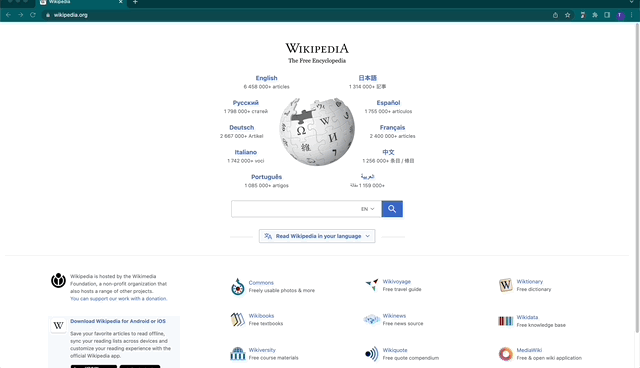

# Jesteer
Jesteer is a Chrome extension that records your browser interactions and generates Puppeteer script.

  

## Overview
With Jesteer, you can automatically generate E2E tests simply by navigating through your application.
  - Testing becomes faster, easier, and less error-prone
    - Developers can spend less time testing, and even non-coders can write robust E2E tests.
    - Conquer seemingly-insurmountable test debt
    - Test apps like end-consumers **use** aps: via the application's UI.

Accelarated by OS Labs.

  

## Main features
- Create end-to-end tests using Puppeteer and Jest, without writing a single line of code
- Record browser interactions
    - Most basic click and type interactions are supported, including navigation
- Generate Puppeteer script
- Take snapshots of DOM elements for regression testing
- Simple UI makes writing tests a pleasure

## How to use it?
- Install Jesteer from the Chrome Web
- Go to the webpage you want to start at for your E2E test
- Open Jesteer, press 'Start Recording'
- Navigate a path through your app: Jesteer is recording.
- When you've finished navigating, open up Jesteer again, click 'Take snapshot' and then take a snapshot of the part of your page displaying the expected behavior
- Optionally continue navigating, take more snapshots
- When finished, click 'Stop Recording', and the input box will be populated with your newly generated test
- Copy/paste into your test suite

## Contributors
Timothy Ruszala

Katie Janzen

Clare Cerullo

Charissa D. Ramirez

## Acknowledgments
A big thank you to the tech accelerator Open Source Labs for their continued support and sponsorship throughout this whole process.

This project is licensed under the ISC license.
